# Photo Style Transfer by Deep Image Analogy

I run photo style transfer by [Deep Image Analogy](https://github.com/msracver/Deep-Image-Analogy).

## Requirement

- Caffe

## Results

| A (input) | AB (output) | BA (output) | B (input) |
|:---------:|:-----------:|:-----------:|:---------:|
| | 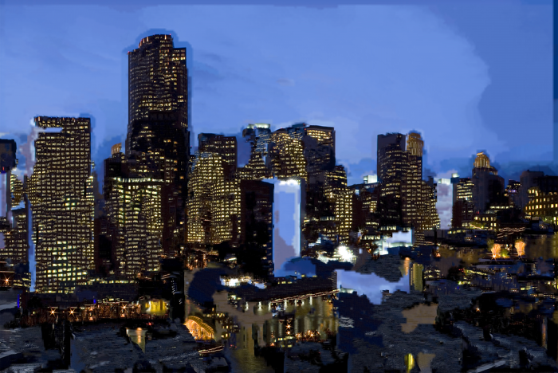 |  |  |
| | 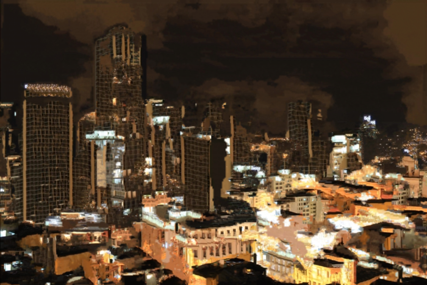 | 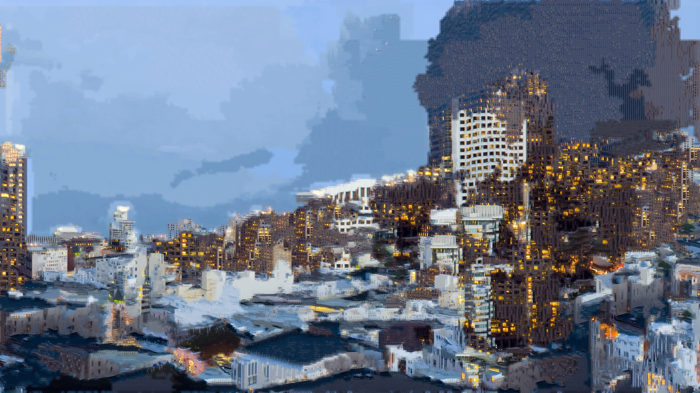 |  |
| | 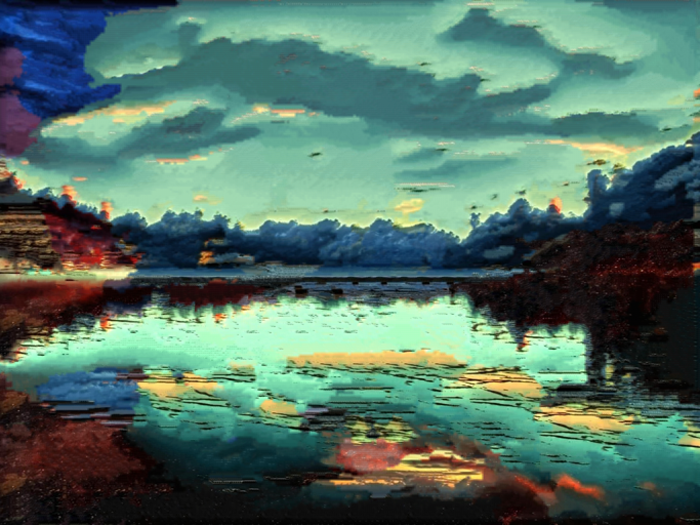 | 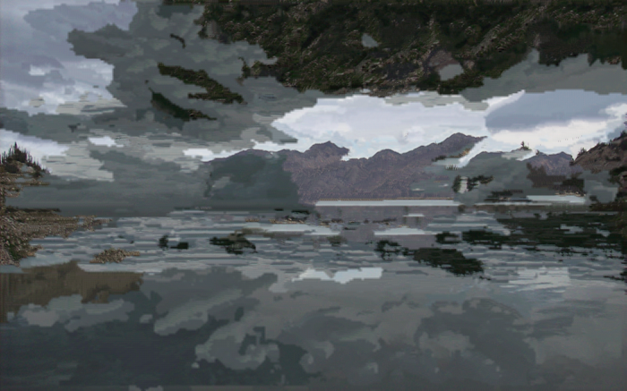 |  |
| | 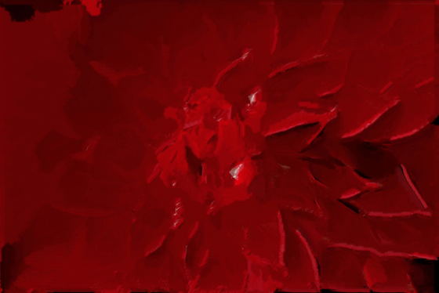 | 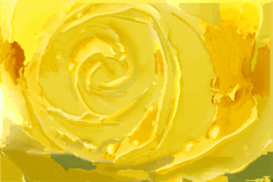 |  |
| | 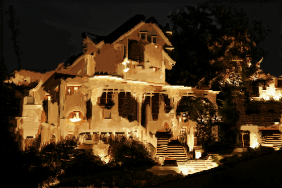 | 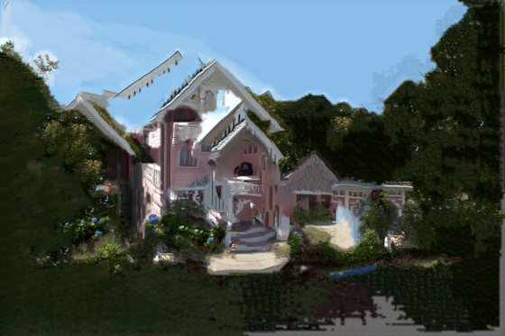 | 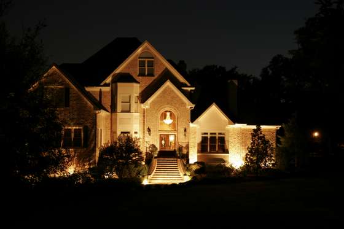 |
| |  |  |  |
| | 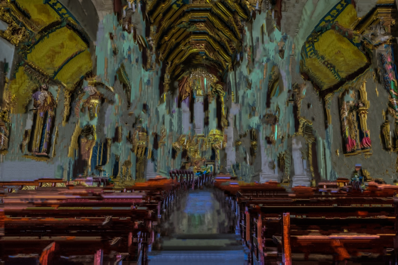 |  | 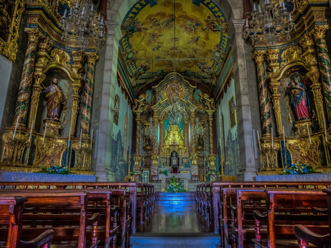 |
|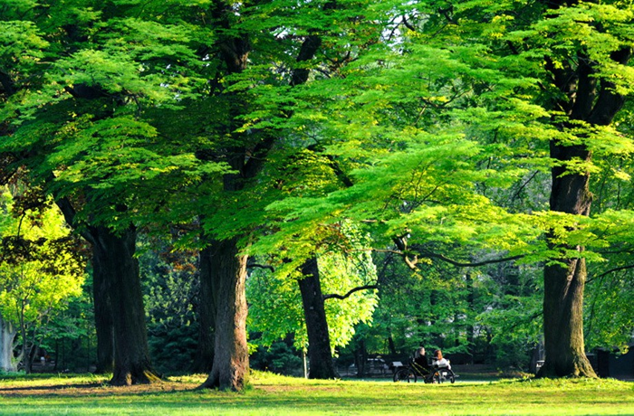 |  |  |  |

## Try it by yourself

### How to Install

```bash
git clone https://github.com/msracver/Deep-Image-Analogy.git
cd Deep-Image-Analogy/
git checkout linux
sh scripts/config_deep_image_analogy.sh

# modify Makefile.config.example
ln -sf Makefile.config.example Makefile.config
make all
sh scripts/make_deep_image_analogy.sh
```

### How to Run

```bash
export LD_LIBRARY_PATH="./build/lib" 
./demo deep_image_analogy/models/ /path/to/img/A.png /path/to/img/B.png /path/to/output/dir/ 0 0.5 2 0
```
